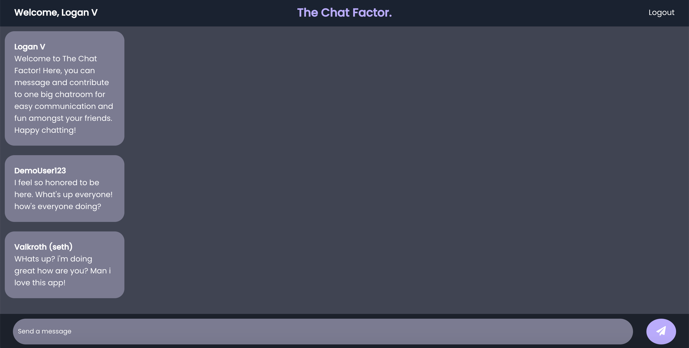

# The Chat Factor

### Links:
Demo - [www.thechatfactor.com](www.thechatfactor.com)
Repo - [https://github.com/loganveik/the_chat_factor](https://github.com/loganveik/the_chat_factor)

### Description:
Once the user signs up and logs in, this app enters you into one big chatroom. You communicate with anyone else who has an account, about any topic imaginable.

### Technologies Used:
React, Firebase(auth/firestore), CSS, Javascript, Node, Express

### How to Use:
1) Signup Page

2) Login Page

3) Chatroom Page
